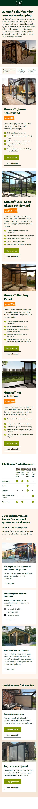
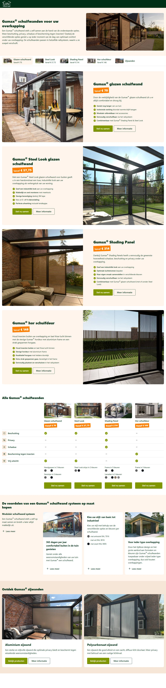
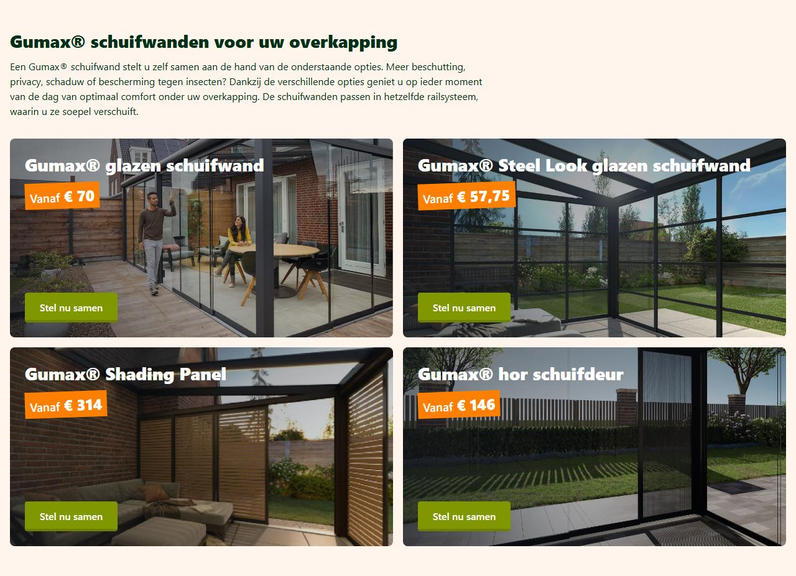
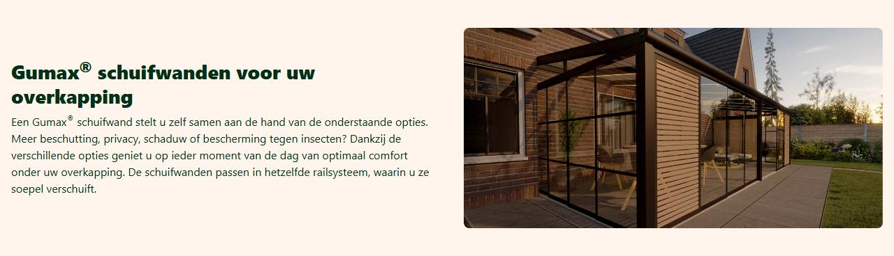
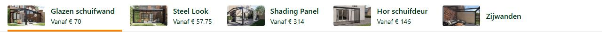
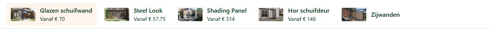
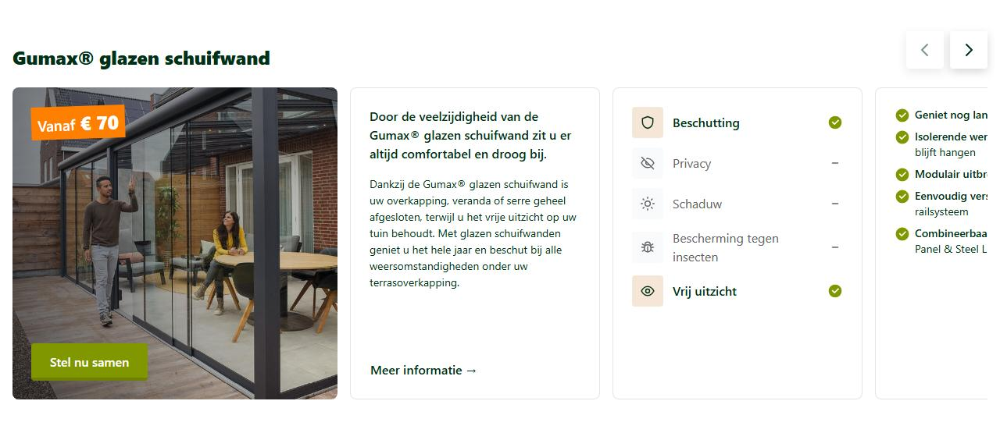
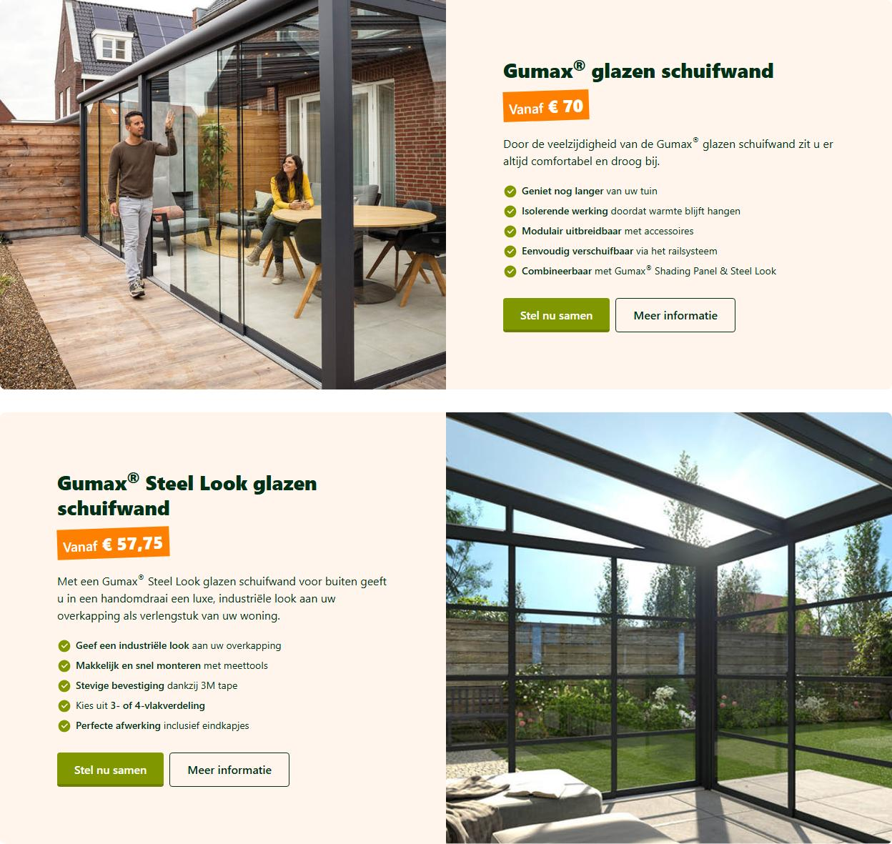
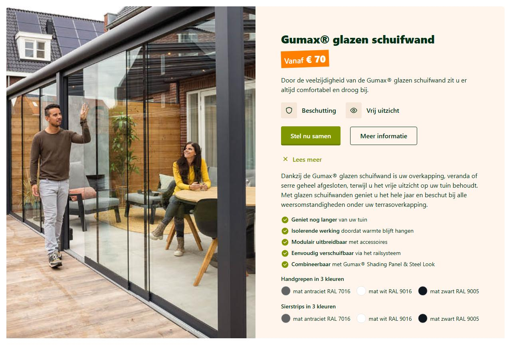
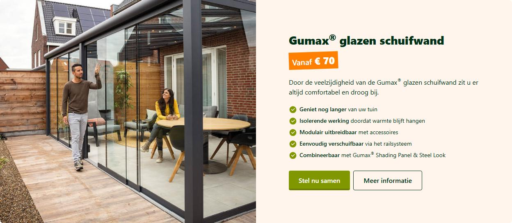

# Approved examples

An approved example is a page the user signed off after review rounds, cleaned against DESIGN.md, build and audit. A build for the same page type starts from it instead of from scratch (build.md → 1. Shape), so it looks right the first time.

| Page type | Example | Parts | Screenshots |
|---|---|---|---|
| Category landing | [category-landing.html](../assets/examples/category-landing.html) | [category-landing.parts.html](../assets/examples/category-landing.parts.html) | [375px](examples/category-landing-375.jpg), [`xl`](examples/category-landing-xl.jpg) |

Each example is a parts file plus the file the assemble script makes from it. Read the parts file; open the assembled file to see it. The design sync re-assembles every example when the skeleton changes, and `npm test` fails when an example drifts from its parts or breaks a build rule a script can check.

## Category landing: /schuifwand

Round 4, variant A ("Naast elkaar") of the /schuifwand redesign, with the page's own copy and images. From the top:

1. **Beige intro:** the H1 and intro beside a modest photo (DESIGN.md → Layout → Beige intro).
2. **Sticky product tabs:** thumbnail, name and "Vanaf €" price per product, the beige pill on the active tab (DESIGN.md → Components → Content patterns → Sticky product tabs).
3. **One light content block per product**, the image alternating left and right (`--media-right`): name, price chip, first sentence, USP list, "Stel nu samen" beside "Meer informatie" (Content patterns → Content block).
4. **Comparison table "Alle Gumax® schuifwanden"** on white: need rows with ticks at every width, colours from `md`, prices and buttons from `lg` (Content patterns → Comparison table).
5. **Benefits on a beige band:** the copy's own headings and first sentences, the rest behind "+ Lees meer", in this one section only.
6. **Side walls on a sand band:** white cards without a border.

The surface changes every one or two sections: beige, white, beige blocks, white, beige, sand.

Cleaning the approved round-4 file changed:

- **Content blocks:** they use the skeleton's `content-block` classes instead of a hand-built grid.
- **Gumax®:** it is superscript in page text, the table caption included.
- **Steel Look block:** it lost its third link ("Bestel de losse Steel Look set"), so it holds two buttons. The modular benefit keeps that link in its copy.
- **Side-wall cards:** they pair the primary with a secondary, `gap-2` apart.
- **Tab script:** it reads positions on scroll only.
- **Comparison table:** the price chips and the button row start at `lg`, not `md`. At `md` the four columns are 114px wide, so "Stel nu samen" wrapped onto two lines.
- **"Kies uw stijl" card:** it shows the three colours as a small swatch row under its sentence. Before, a sand panel of large swatches stood in for a photo, which the source doesn't have.
- **Small fixes:** the tab hover is a lighter-green label instead of a grey fill, and "+ Lees meer" has a 44px hit area.

To use it for another category landing, copy the parts file, write your own plan line and registry, and replace the copy, images, prices and needs with the source page's own. Drop the sections the page has no content for; never keep the /schuifwand copy as filler. The variants then vary only the design question, as in a later round (build.md → 3. Later rounds).

| 375px | `xl` |
|---|---|
|  |  |

## Do and don't, from the four rounds

**Intro.** Don't open a category landing with large image tiles (round 1): they felt bulky and "in your face". Do: the H1 and intro beside a modest photo.

| Don't | Do |
|---|---|
|  |  |

**Active tab.** Don't mark the active tab with an orange bar (round 1): orange active states belong to the main menu. Do: the beige pill.

| Don't | Do |
|---|---|
|  |  |

**Flow.** Don't put a product's content in a carousel (round 2): most of it sits off-screen. Do: stack the blocks vertically.

| Don't | Do |
|---|---|
|  |  |

**Content block.** Don't put "Lees meer" in a content block (round 3): opened, it grows the text and the flush photo stretches with it. Need icons and colour lines crowd the block too. Do: the light block.

| Don't | Do |
|---|---|
|  |  |
